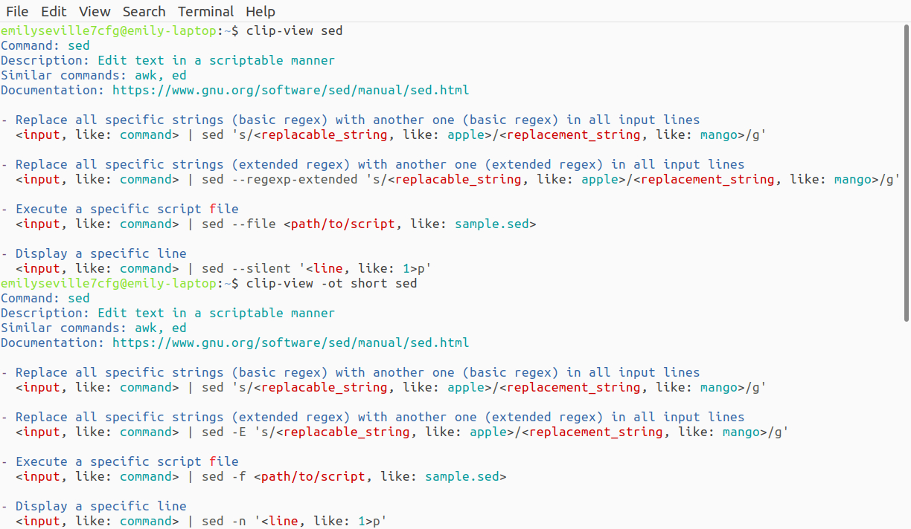
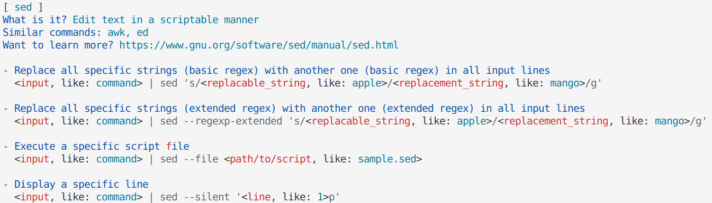

# Render for Command Line Interface Pages

Render for Command Line Interface Pages.

## Features

- Several render modes smarter than almost all TlDr clients provide.
- Theming support via YAML files.

## Examples

### Rendering

Command: `clip-view sed`.

Input Command Line Interface Page:

```md
# sed

> Edit text in a scriptable manner
> See also: awk, ed
> More information: https://www.gnu.org/software/sed/manual/sed.html

- Replace all specific strings (basic regex) with another one (basic regex) in all input lines:

`{string input: command} | sed 's/{string replacable string: apple}/{string replacement string: mango}/g'`

- Replace all specific strings (extended regex) with another one (extended regex) in all input lines:

`{string input: command} | sed {option: --regexp-extended, -E} 's/{string replacable string: apple}/{string replacement string: mango}/g'`

- Execute a specific script [f]ile:

`{string input: command} | sed {option: --file, -f} {/?file script: sample.sed}`

- Display a specific line:

`{string input: command} | sed {option: --silent, -n} '{int line: 1}p'`
```

Output:



#### Get page

Run `clip-view sed`.

### Theming

[](https://github.com/emilyseville7cfg-better-tldr/prototypes/blob/main/clip-view/theme.json)

Input Command Line Interface Page theme with the same page:

```yaml
header:
  prefix: "[ "
  suffix: " ]"
summary:
  description:
    prefix: "What is it? "
  tag:
    more-information:
      prefix: "Want to learn more? "
```

Output:



#### Get intellisence

Add to Visual Studio Code settings:

```json
"yaml.schemas": {
    "path/to/theme.json": "path/to/file_where_enable_intellisence.yaml"
}
```